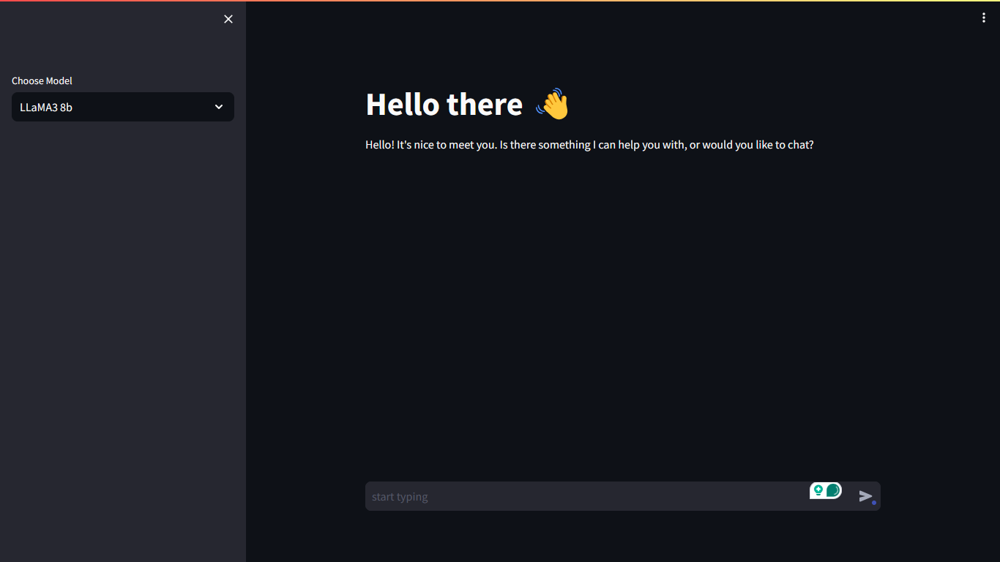

# LLM-implementation using groq api with streamlit
 - In this project I have used the groq api to implement the power of LLM(Large Language Models) in a streamlit web app

 

## DEMO
 - You can check the DEMO [here](https://8501-01hwj8ynshjz7spkr595x77ec2.cloudspaces.litng.ai/)

## Libraries Used
 - dotenv
 - streamlit
 - groq

## Installation
 1. Prerequisites
    - Git
    - Command line familiarity
 2. Clone the Repository: `git clone https://github.com/NebeyouMusie/LLM-implementation-using-groq-api-with-streamlit.git`
 3. Create and Activate Virtual Environment (Recommended)
    - `python -m venv venv`
    - `source venv/bin/activate`
 4. Navigate to the projects directory `cd ./LLM-implementation-using-groq-api-with-streamlit` using your terminal
 4. Install Libraries: `pip install -r requirements.txt`
 5. run `streamlit run app.py`
 6. Open the link displayed in the terminal on your browser
 7. Start typing on the chat box

## Contributions
 - Contributions are welcomed

## Support
 - Give this project a star ⭐ if you like it
   
## Author
 - LinkedIn: [Nebeyou Musie](https://www.linkedin.com/in/nebeyou-musie)
 - Gmail: nebeyoumusie@gmail.com
 - Telegram: [Nebeyou Musie](https://t.me/NebeyouMusie)
    

